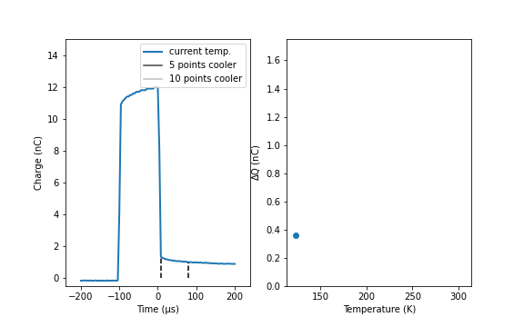

# Deep Level Transient Spectroscopy
Electrical properties of materials are extremely important.
There are a variety of tests in use to characterize defects in materials that affect the electrical properties, but here we focus on deep level transient spectroscopy (DLTS).
For a DLTS measurement, a sample is first cooled to a low temperature.
A voltage pulse is applied to a sample and the charge is measured.
We measure the difference in charge at two distinct times to determine the change in charge.
This process is repeated at various temperatures as the sample is heated.
As the sample temperature increases, electrical defects become active at characteristic activation temperatures.
This measurement elucidates the quantity and type of defect present.

# Visualizing DLTS measurements
Using matplotlib, we can animate this measurement to help more clearly represent how the data is captured.
