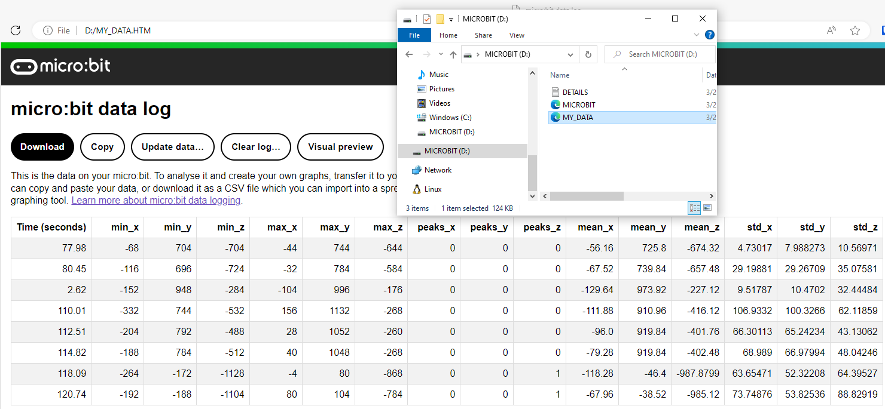

# Micro:bit Gesture Recognition

## Machine Learning for edge devices
Imagine a collection of accelerometers mechanically coupled to various parts of an assembly line.
While significant vibrations are expected in a busy factory setting, anomalous patterns in the movement of the components could indicate that a component will fail soon.
Using vibration detection as an early warning system could improve the efficiency of the assembly line by alerting operators so that required maintenance can be performed before more costly repairs are necessary.
While monitoring acceleration in three dimensions across hundreds or thousands of components is possible, it introduces additional complexity into the system.
Instead of streaming raw data to the cloud or a central computer that could be a single point of failure, pushing the machine learning models to the edge devices themselves can make for a more robust and efficient system.
This project details one such edge ML implementation.

I wanted to see if I could train a machine learning model to correctly identify gestures based on accelerometer data.
Since this is an edge ML demonstration, the trained model needed to be able to run on the device itself.
I used a [micro:bit](https://microbit.org/get-started/user-guide/features-in-depth/) for this project because of its Micropython support and on-board accelerometer.
With the hardware selected, I was left with three distinct tasks:

1. Measure training and testing data on the micro:bit
1. Train a machine learning model using the measured data
1. Implement the model on the micro:bit to detect gestures

I will describe the first step below.

## Measure training and testing data on the micro:bit
In order to measure the training and testing data using the accelerometer of the micro:bit, we will need to write some MicroPython.
There are a couple of convenient ways to do that, including the [online editor](https://python.microbit.org/) or [Thonny](https://thonny.org/).
Alternatively, you could grab the most recent [micro:bit firmware](https://github.com/microbit-foundation/micropython-microbit-v2/releases) and do it yourself.

Micro:bit  sensors, inputs, and outputs are accessible via the well-documented micro:bit  Micropython API.
The heart of our measurement script will be the `microbit.accelorometer.get_values()` function documented [here](https://microbit-micropython.readthedocs.io/en/v2-docs/accelerometer.html#microbit.accelerometer.get_values) which returns the acceleration in X, Y, and Z directions.
The code for measuring this data is [measure_data.py](measure_data.py) and is hosted in this folder.

Instead of simply streaming the raw accelerometer data into the model, we will instead calculate some descriptive statistics on the accelerometer data, then use those readings to classify the gesture type.
In my experience this produced more reliable results.

When a measurement is started, 100 acceleration measurements are taken in each dimension, for a total of 300 measurements.
Then for each dimension, the minimum, maximum, number of peaks, mean, and standard deviation of those 100 measurements is computed.
These 15 data points (5 calculated points times 3 dimensions) are recorded and will be the training data for our model.

## Logging the data

I leverage the [log module](https://microbit-micropython.readthedocs.io/en/v2-docs/log.html) to save the measurements for one gesture to a csv file that can be used to train the model.
Here is a gif of the data logging in action

After recording multiple measurements for a single gesture, I access the data by disconnecting and reconnecting the micro:bit.
Then I can open the micro:bit's file system in file explorer and open `DATA.HTM`, which looks something like this.

