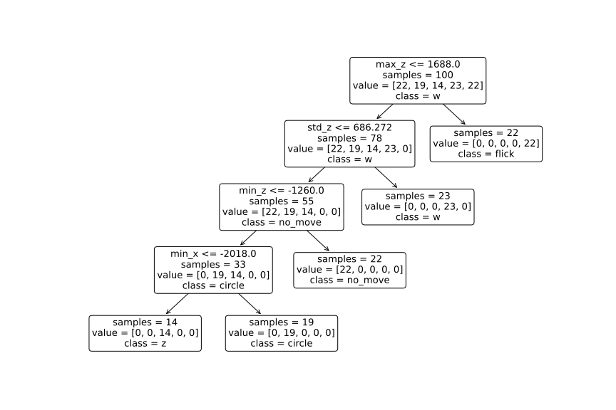
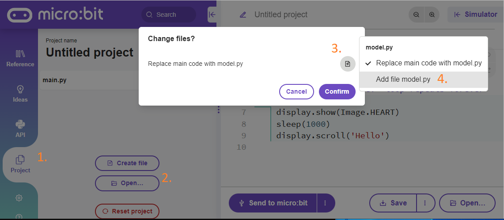
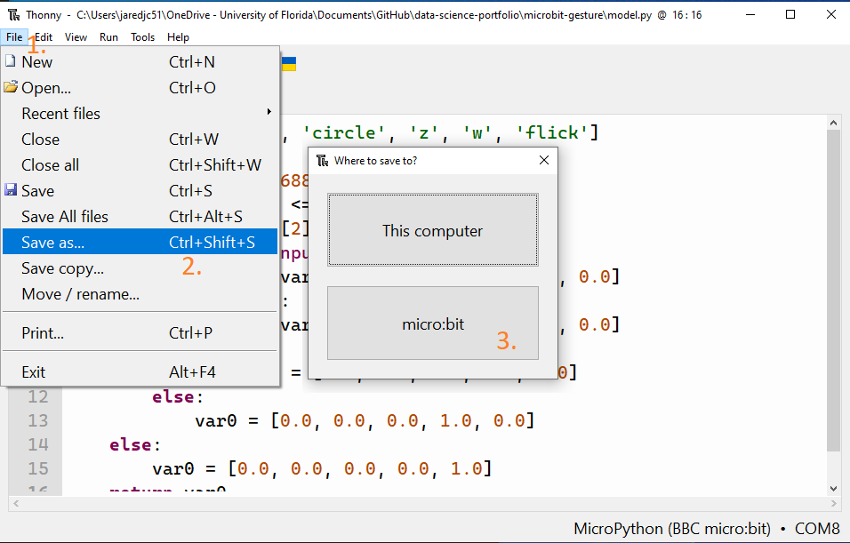

# Micro:bit Gesture Recognition

## Machine Learning for edge devices
Imagine a collection of accelerometers mechanically coupled to various parts of an assembly line.
While significant vibrations are expected in a busy factory setting, anomalous patterns in the movement of the components could indicate that a component will fail soon.
Using vibration detection as an early warning system could improve the efficiency of the assembly line by alerting operators so that required maintenance can be performed before more costly repairs are necessary.
While monitoring acceleration in three dimensions across hundreds or thousands of components is possible, it introduces additional complexity into the system.
Instead of streaming raw data to the cloud or a central computer that could be a single point of failure, pushing the machine learning models to the edge devices themselves can make for a more robust and efficient system.
This project details one such edge ML implementation.

I wanted to see if I could train a machine learning model to correctly identify gestures based on accelerometer data.
Since this is an edge ML demonstration, the trained model needed to be able to run on the device itself.
I used a [micro:bit](https://microbit.org/get-started/user-guide/features-in-depth/) for this project because of its Micropython support and on-board accelerometer.
With the hardware selected, I was left with three distinct tasks:

1. Measure training and testing data on the micro:bit
1. Train a machine learning model using the measured data
1. Implement the model on the micro:bit to detect gestures

I will describe the first step below.

## Measure training and testing data on the micro:bit
In order to measure the training and testing data using the accelerometer of the micro:bit, we will need to write some MicroPython.
There are a couple of convenient ways to do that, including the [online editor](https://python.microbit.org/) or [Thonny](https://thonny.org/).
Alternatively, you could grab the most recent [micro:bit firmware](https://github.com/microbit-foundation/micropython-microbit-v2/releases) and do it yourself.

Micro:bit  sensors, inputs, and outputs are accessible via the well-documented micro:bit  Micropython API.
The heart of our measurement script will be the `microbit.accelorometer.get_values()` function documented [here](https://microbit-micropython.readthedocs.io/en/v2-docs/accelerometer.html#microbit.accelerometer.get_values) which returns the acceleration in X, Y, and Z directions.
The code for measuring this data is [measure_data.py](measure_data.py) and is hosted in this folder.

Instead of simply streaming the raw accelerometer data into the model, we will instead calculate some descriptive statistics on the accelerometer data, then use those readings to classify the gesture type.
In my experience this produced more reliable results.

When a measurement is started, 100 acceleration measurements are taken in each dimension, for a total of 300 measurements.
Then for each dimension, the minimum, maximum, number of peaks, mean, and standard deviation of those 100 measurements is computed.
These 15 data points (5 calculated points times 3 dimensions) are recorded and will be the training data for our model.

## Logging the data

I leverage the [log module](https://microbit-micropython.readthedocs.io/en/v2-docs/log.html) to save the measurements for one gesture to a csv file that can be used to train the model.
Here is a gif of the data logging in action for a "circle" gesture.


After recording twenty measurements for a single gesture, I access the data by disconnecting and reconnecting the micro:bit.
Then I can open the micro:bit's file system in file explorer and open `DATA.HTM`, which looks something like this.


I then download this data as a .csv file and repeat the process for different gestures.
For the purposes of this project I created data for the following gestures:

- no move
- circle
- z
- w
- flick

## Training the machine learning model
Now we are ready to train the machine learning model on our measured data!
For this part we will need `pandas`, `sklearn`, `m2cgen`, and `matplotlib`.

[m2cgen](https://github.com/BayesWitnesses/m2cgen) is a model to code generator, allowing us to export our trained model as pure python code that will run on the micro:bit.
This is the only package on the list that isn't built into Anaconda, so you might have to run `!pip install m2cgen` at the top of the notebook if it's not already installed.
Then all of the packages can be imported like so:

```python
import pandas as pd
from sklearn.model_selection import train_test_split
from sklearn.tree import DecisionTreeClassifier, plot_tree
import m2cgen as m2c
import matplotlib.pyplot as plt
```

Now we have to import the data.
This done by making a list of the files we downloaded from the microbit, then loading them into pandas dataframes.
Finally each measurement is assigned a label to identify the type of gesture and all of the different gestures are concatenated into a single dataframe.

```python
#######################
##### Change this #####
files = ['no_move.csv',
         'circle.csv',
         'z.csv',
         'w.csv',
         'flick.csv'
        ]
######################

# List motions without file extensions
motions = [x[:-4] for x in files]

# Initialize an empty list to hold each file
dfs = []
# Go through each file
for i,file in enumerate(files):
    # Read the data into Pandas
    df = pd.read_csv('data/'+file)
    df = df.drop('Time (seconds)', axis=1)
    df['label'] = i
    dfs.append(df)
d = pd.concat(dfs, ignore_index=True)
```

In order to evaluate how well our model will perform in the "real world" we need to have testing data that the model has never seen before.
The easiset way to do this is to separate all of our measurements into a "training" portion and a "testing" portion.
That is what the `train_test_split()` function does.

```python
X_train, X_test, y_train, y_test = train_test_split(d.drop('label', axis=1).values, d['label'].values, test_size=0.2)
```

With our training data ready, we can train the model.
For this machine learning model, we will use a decision tree classifier. A decision tree classifier works somewhat like the game 20 questions: the computer asks yes or no questions about the data. Based on the response, the computer will ask different questions until it's reasonably sure of the answer. These different Yes/No chains kind of look look like a tree, hence the name decision tree classifier.

Since the only information the model has access to are the 15 data points for each run, the yes/no questions are all in the form of inequalities (e.g Is the max acceleration in the z direction >= 1688?).

```python
# Tell the computer we want a decision tree classifier
dtc = DecisionTreeClassifier()
# Use the training data to train the model
dtc = dtc.fit(X_train, y_train)
```

We can visualize the decision tree classifier as a series of boxes that each ask a single question.
If the answer is yes, follow the arrow that goes down and to the left.
If the answer is no, follow the arrow that goes down and to the right.
Keep going until there are no more arrows to follow, then look at the "class" to determine the gesture type!



Last, we need to export the model as pure python code that can run on the micro:bit.
This is possible using `m2cgen`:

```python
# convert model to pure python code
code = m2c.export_to_python(dtc)
# save converted model as .py file
with open('model.py', 'w') as f:
    # save list of motions to model file
    f.write(f"{motions = }\n")
    # save decision tree function to model file
    f.write(code)
```

## Deploying the model

### Loading the model
Now that the model is trained on the data we measured from the device, we are ready to load the model onto the micro:bit.
First, use the code editor to load the `model.py` module that was created in the previous step on to the micro:bit.

In the [online micro:bit Python editor](https://python.microbit.org/v/3), the file can be added to the device by selecting Project > Open.
After selecting your file, be sure to select "Add file model.py" instead of the default "Replace main code with model.py" by clicking on the file icon.
Otherwise, you risk overwriting code that you are currently working on.
See the image below for an example.



To upload the file using Thonny, connect to the micro:bit, then select File > Save As, and click the option to save the file to the micro:bit.
The image below shows where to click:



### Predicting motion
The final step in the process is to write code so the micro:bit can use the model we just loaded to predict motion based on the accelerometer data.
This code is found in the [predict_motion.py](predict_motion.py) file.
Since this program will measure data from the accelerometers in the same way the [measure_data.py](measure_data.py) program, we will focus on the differences here.

In the `predict_motion.py` file, the following lines enable the program to return the best guess for the gesture.

```python
# names of motions
motions = model.motions
def result(v):
    # get result from model
    res = model.score(v)
    # find index of most likely motion
    i = res.index(max(res))
    # return name and confidence of motion
    return (motions[i], res[i])
```

The motions that were defined when we trained the model were saved to the `motions` variable in the `model.py`.
Next, the result function is defined to make the output more user-friendly.
The unedited result of the model returns a list indicating the confidence of the result, *e.g.* `[1.0, 0.0, 0.0, 0.0, 0.0]` would indicate a high confidence in the first gesture and a low confidence in the other measured gestures.
Instead of returning this list, we determine the maximum value in the list, then return the name of the gesture that corresponds with this measurement.

With these files loaded on the micro:bit, it can now measure acceleration data, feed that data into the model, and have the model identify the gesture.