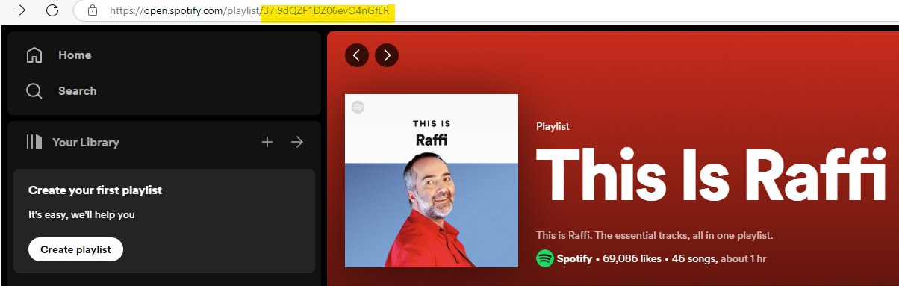

# Analyzing Songs with Spotify Data
Spotify is a popular music streaming platform and is well known for its powerful recommendation engine.
The ability to introduce users to music that they will probably enjoy is a key reason so many people use Spotify.
While Spotify would never share all of their recommendation methods, they do make a good deal of information available for each of their songs through their [well-documented API](https://developer.spotify.com/documentation/web-api).
In the following sections, we will explore how to get data from Spotify playlists and use that data for exploratory data analysis.

## Accessing Spotify's API
In order to get access to Spotify's API, you first need to register for a Spotify developer account.
If you already have a free or paid Spotify account, you can use that, or you can create a new free account.

Next, you will need to get client credentials.
To do this, I followed [Steven Morse's work](https://stmorse.github.io/journal/spotify-api.html) exactly and suggest you do the same.
At the end of this process you will have a `CLIENT_ID` and a `CLIENT_SECRET`, strings of letters and numbers that prove that you are a user with permission to get data from Spotify's API.
If someone else gets access to these secret strings, they can access Spotify by impersonating you and potentially commit ban-able offenses so it's a good idea to keep those things a secret.

I created a new file called `config_secrets.py` that looks like this:

```python
CLIENT_ID = 'myclientid'
CLIENT_SECRET = 'myclientsecret123'
```

This file was also added to my `.gitignore` for this project so it isn't inadvertently uploaded.

Now we are ready to use Spotify's API to get our access token, which will let us send and receive requests.
Following Morse's work again we first define variables for our credentials and URLs

```python
# Thank you to https://stmorse.github.io/journal/spotify-api.html for getting started
import pandas as pd # csv and dataframes
import requests # Spotify API
import config_secrets # Retrieve my secrets from this file

# Secrets from developer.spotify.com account
# You would have to change this
CLIENT_ID = config_secrets.CLIENT_ID
CLIENT_SECRET = config_secrets.CLIENT_SECRET

# How to get a token
AUTH_URL = 'https://accounts.spotify.com/api/token'

# Where to send spotify GET requests
BASE_URL = 'https://api.spotify.com/v1/'
```

Next, we politely ask for our token and prepare to send it with our future requests.

```python
# POST to get our access token
auth_response = requests.post(AUTH_URL, {
    'grant_type': 'client_credentials',
    'client_id': CLIENT_ID,
    'client_secret': CLIENT_SECRET
})

auth_response_data = auth_response.json()
access_token = auth_response_data['access_token']

# Include this in every GET request to make sure we have access
headers = {'Authorization': f"Bearer {access_token}"}
```

With our token in hand, we are ready to get song data from Spotify playlists.

## Getting Song Data from Spotify Playlists
Getting the data from all the songs on a playlist is a two step process:

1. Use the [Get Playlist Items](https://developer.spotify.com/documentation/web-api/reference/get-playlists-tracks) `GET` request to get the unique idetifier for each song.
1. Use the [Get Tracks' Audio Features](https://developer.spotify.com/documentation/web-api/reference/get-playlists-tracks) `GET` request to get the audio features for the songs in the playlist.

We need the playlist id to make the Get Playlist Items request. This id can be found in the URL of the playlist on Spotify, as indicated in the image below.



This is all of the information you need to explore my [Get Spotify Playlist Data](Get%20Spotify%20Playlist%20Data.ipynb) notebook.
You can launch a live version using JupyterLite with the link below.


[](https://jupyterlab-open-url-param.readthedocs.io/en/latest/lite/lab?fromURL=https://raw.githubusercontent.com/jaredcarter/data-science-portfolio/main/spotify-data/Get%20Spotify%20Playlist%20Data.ipynb)